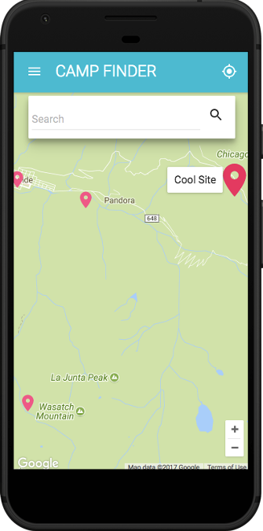
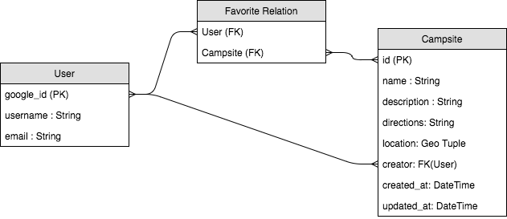
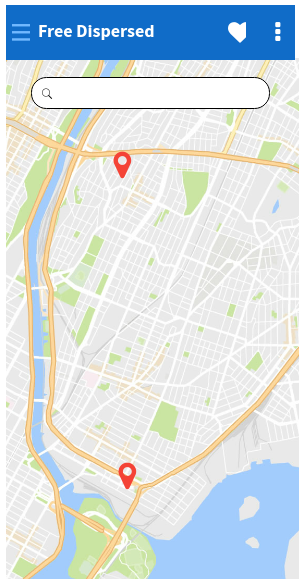
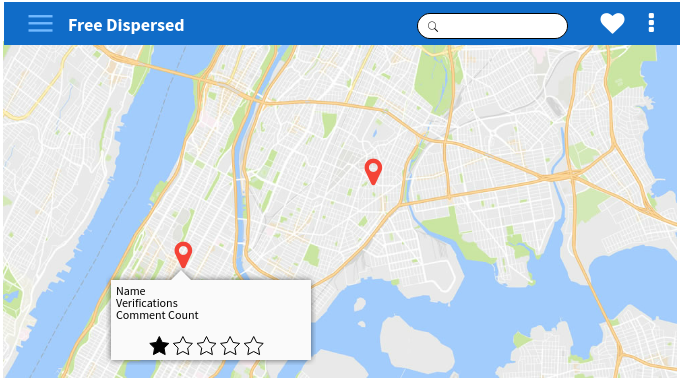
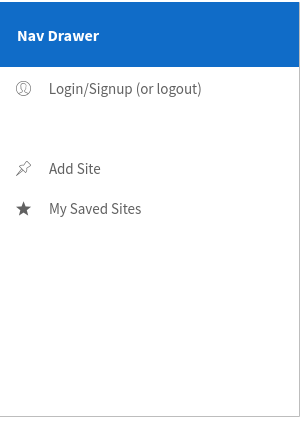
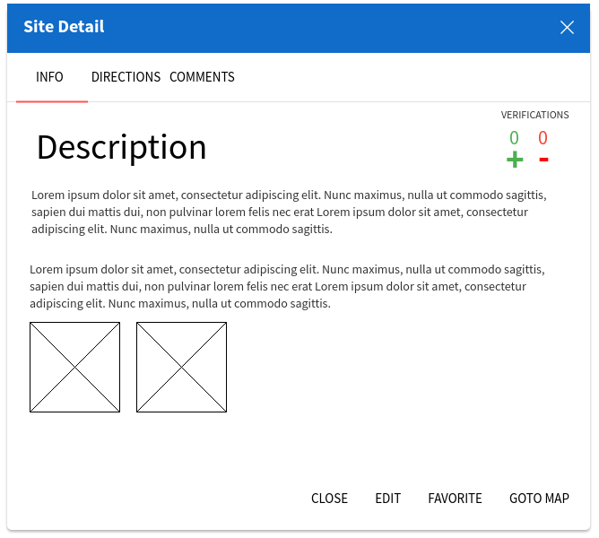
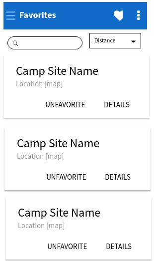

# free-camp-map
An open source web app where tent campers can share the location of free camp sites.

Try a current version on Heroku ***[HERE](https://camp-free.herokuapp.com/)***

## contibuting / install instructions
Please contribute to the map data by signing up and adding some spots.

If you'd like to contribute to the application, follow the setup instructions:

* **Fork and clone the repo**

*FRONTEND:*
1) `cd frontend && npm install`
2) `touch .env`
3) Add `REACT_APP_MAP_KEY=[google maps api key]` and `REACT_APP_GEOCODE_KEY=[google geocode api key]` to `.env`
4) `npm run start`

*BACKEND:*
1) Setup local postgres db (see `settings.py` `DATABASES`)
2) Start your local python env
3) `pip install -r requirements.txt`
4) `python manage.py makemigrations`
5) `python manage.py migrate`
6) `python manage.py runserver`

*BUILD:*
1) `cd frontend && npm run build`
2) `cd .. && python movebuild.py` (moves the react build files into the appropriate static folder)

## Technology used
#### Frontend:
* React
* create-react-app
* [google-map-react](https://github.com/istarkov/google-map-react) 
    * An easy-to-use React map component. It comes with methods for displaying custom map markers
* Google Maps and Geocode API (api keys required)
    * The geocode key is required for processing searches
* [Material-Ui](http://www.material-ui.com/#/)
    * A React UI component library that conforms to Material Design standards

#### Backend:
* Django
* [Django Rest Framework](http://www.django-rest-framework.org/)
    * Useful for quickly building REST APIs with Django
* [Django Rest Auth](http://django-rest-auth.readthedocs.io/en/latest/)
    * Simplifies Auth and user registration when using django with an SPA
* Postgres

## Approach
The idea for the app arose out of frustration using one of my favorite websites: [freecampsites.net](https://freecampsites.net/). This website enables user's to share free (or cheap) campsites with other users on a map. The site is useful because the dataset they have collected is large. However, the interface is sluggish and challenging to use on mobile (which is the most common way of accessing the site). Also, much of the data is heavily biased towards RV campers and includes a lot of paid sites.

Therefor the idea is to build a modern web application that is easy to use on a mobile device from remote locations where tent campers can find and share completely free places to camp. Anyone should be able to find sites quickly and be able to easily login or create an account if they'd like to share a site or save a site for later.

Using a modern webframework (React) helps both with usability and quick production times. Django was chosen as a backend due to its rich set of features for quickly building strong backends.

## Unsolved Challenges
* There are several user stories left to implement. Only the most basic functionality (view and create) is available at this point
* Only the Campsite and User data models have been built
* Too much data: the api currently serves ALL of the campsites instead of querying by distance (not ideal when you're concerned with poor data reception in remote areas)
* There is no offline support (service workers)
* Redux should be implemented to simplify frontend code
* GraphQL could be used to simplify queries

## User stories

Show User Stories

* [X] I can view a map
* [X] I can search for a location on the map
* [X] I can see nearby campsites as pins on the map
* [ ] I can click on a pin for more details about the campsite
* [ ] I can return to the map from the detail view
* [ ] I can share the link to a campsite
* [X] I can login/signup
* [ ] I can save/star campsites
* [X] I can add a campsite to the map
* [ ] I can rate campsites I've been to
* [ ] I can comment on a campsite
* [ ] I can submit edits to campsite info
* [ ] I can positively or negatively verify a campsite that I have visited
* [ ] I can upload pictures of a campsite
* [ ] I can sort my favorite sites by distance
* [ ] I can refresh the page without losing my data while viewing, creating, editing sites
* [ ] I can see the username of whoever created and last updated the site info
* [ ] Sites I create will automatically be added to my favorites
* [ ] Sites I create will be visually distinct from other sites
* [ ] I can see how long its been since the campsite has been updated

Trello Board: https://trello.com/b/tisXBo5l/free-sites

## Data Models

Show Data Models (User, Campsite, Comment, Rating)

#### User
- username: *string*
- google_id: *string*
- favorites: *[]Campsite* (many-to-many)
- email: *string*

#### Campsite
- name: *string*
- location(lat, lon): *geo tuple*
- description: *string*
- directions: *string*
- positive_verify_count: *int*
- negative_verify_count: *int*
- photos: *file*
- rating: *double* (updated with calculate rating method)
- favorited_by (hidden): *[]User* (many-to-many)
- creator: *User_id* (one-to-many)
- updated_at: *datetime*
- last_updater: *User_id* (one-to many)

#### Comment
- author: *User_id* (one-to-many)
- content: *string*
- created at: *datetime*
- campsite: *Campsite_id* (one-to-many)

#### Ratings
- campsite: *Campsite_id*
- rater: *User_id*

#### ERD (mvp):

## Wireframes/Mockups

Show Wireframes

#### Mobile

#### Desktop

#### Nav/Drawer

#### Detail component

#### Favorites list

